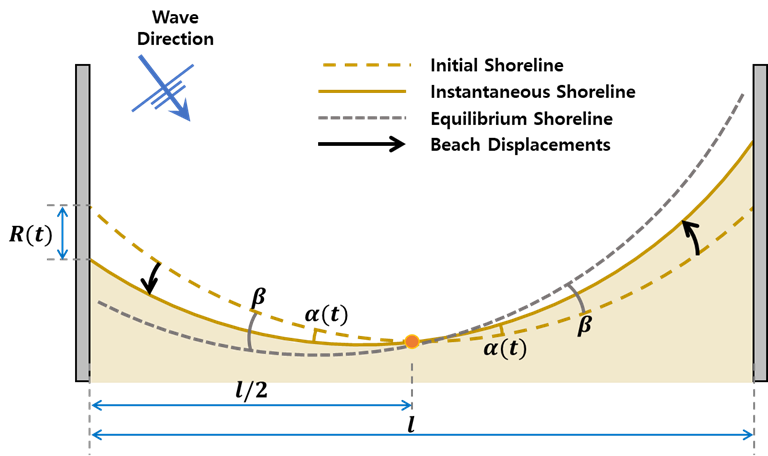

# IHSetTurki

## Summary

Unlike previously introduced beach advance/retreat by the incoming wave energy, the shoreline rotation depends on the longshore sediment transport where wave directionality is paramount. Under the assumption that the instantaneous shoreline position depends on the equilibrium one, Turki et al. (2013) proposed a simple shoreline evolution model for predicting shoreline rotation. This model is useful to understand the dynamics of the shoreline evolution caused by wave direction. In addition, this model simply predicts temporal evolution in beach rotation.

## Model formula

Turki et al. (2013) suggested a shoreline rotation model considering that the shoreline response rate can be expressed as proportional to the difference between the instantaneous position and the equilibrium rotation as follows:

```text
(∂R(t))/∂t=ω(R_∞-R(t))

ω : the ratio of beach change which is proportional to the characteristic time scale
R_∞ : the equilibrium shoreline response
R(t) : the instantaneous position at time t
```



Fig. Definition sketch of shoreline rotation model proposed by Turki et al. (2013).
